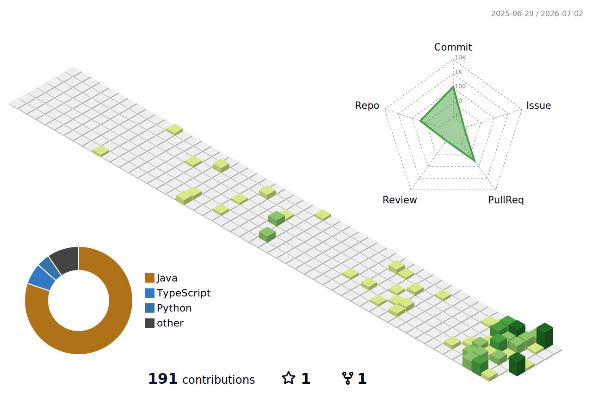

## 👋 About Me

- 🧑‍💻 一句话自我介绍（在这里填写你的身份/方向）
- 🔭 目前在做：占位，填写你正在进行的项目
- 🌱 正在学习：占位，填写你正在学习的技术
- 💬 关于我：占位，填写你想分享的内容
- 📫 联系方式：占位，填写邮箱/其他联系方式

## 🛠 Tech Stack

## 📊 GitHub Stats

  
  

  

## 🌐 3D Contribution Graph

<picture>
  <source media="(prefers-color-scheme: dark)" srcset="profile-3d-contrib/profile-night-rainbow.svg">
  <source media="(prefers-color-scheme: light)" srcset="profile-3d-contrib/profile-green.svg">
  
</picture>

## 🐍 Snake Contribution Graph

<picture>
  <source media="(prefers-color-scheme: dark)" srcset="profile-snake-contrib/github-contribution-grid-snake-dark.svg">
  <source media="(prefers-color-scheme: light)" srcset="profile-snake-contrib/github-contribution-grid-snake.svg">
  
</picture>

---

