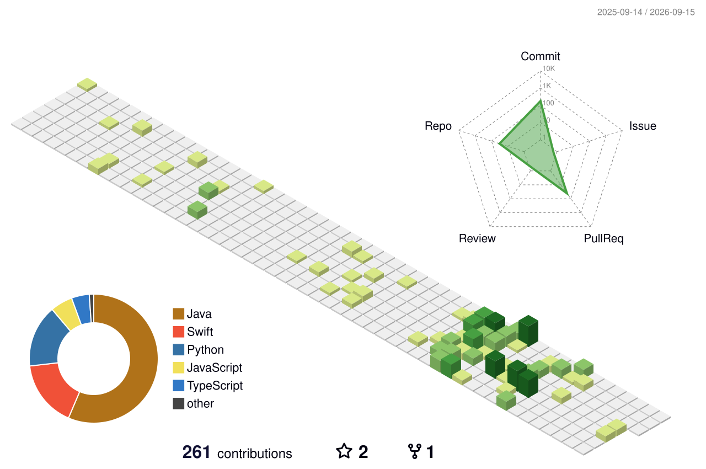
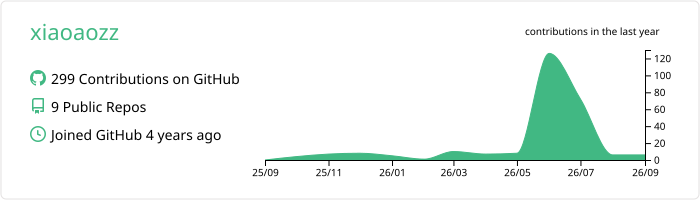

## 🌐 3D Contribution Graph

<picture>
  <source media="(prefers-color-scheme: dark)" srcset="profile-3d-contrib/profile-night-rainbow.svg">
  <source media="(prefers-color-scheme: light)" srcset="profile-3d-contrib/profile-green.svg">
  
</picture>

## 🐍 Snake Contribution Graph

<picture>
  <source media="(prefers-color-scheme: dark)" srcset="profile-snake-contrib/github-contribution-grid-snake-dark.svg">
  <source media="(prefers-color-scheme: light)" srcset="profile-snake-contrib/github-contribution-grid-snake.svg">
  
</picture>

## 👋 About Me

|  |  |
| :--- | :--- |
| 🧑‍💻 **Role** | Test Development Engineer · AI Enthusiast · Open Source Lover |
| 🌱 **Learning** | Vibecoding · AI Agent · LLM Engineering |
| ✨ **Motto** | Stay passionate. Chase the next mountain and the next sea. |
| 📫 **Contact** | [xiaoaozz@qq.com](mailto:xiaoaozz@qq.com) |

## 🛠 Tech Stack

<!-- PROJECTS:START -->
<!-- Edit projects.json, then run: python3 scripts/render_projects.py -->

## 🚀 Featured Projects

<table>
  <tr>
    <td width="50%" valign="top">
      <h3>🤖 <a href="https://github.com/xiaoaozz/AgentPulse">AgentPulse</a></h3>
      
A lightweight native dashboard for tracking Codex, Claude Code, and custom AI Agent sessions across macOS and Windows.

      
<code>Swift</code> <code>SwiftUI</code> <code>WinUI 3</code> <code>.NET 8</code>

      <a href="https://github.com/xiaoaozz/AgentPulse">View repository →</a>
    </td>
    <td width="50%" valign="top">
      <h3>🧠 <a href="https://github.com/xiaoaozz/KfSmart">KfSmart</a></h3>
      
An enterprise-grade RAG knowledge base with intelligent document processing, semantic search, and multi-tenant access control.

      
<code>Java</code> <code>Spring Boot</code> <code>Vue 3</code> <code>Elasticsearch</code>

      <a href="https://github.com/xiaoaozz/KfSmart">View repository →</a>
    </td>
  </tr>
  <tr>
    <td width="50%" valign="top">
      <h3>🛠️ <a href="https://github.com/xiaoaozz/learn-claude-code">learn-claude-code</a></h3>
      
A from-scratch exploration of coding-agent harness engineering, covering tools, context, permissions, and agent loops.

      
<code>TypeScript</code> <code>AI Agent</code> <code>LLM</code>

      <a href="https://github.com/xiaoaozz/learn-claude-code">View repository →</a>
    </td>
    <td width="50%" valign="top">
      <h3>☕ <a href="https://github.com/xiaoaozz/jvm-by-head-go">jvm-by-head-go</a></h3>
      
A JVM implementation written in Go, built to explore class loading, class-file parsing, and bytecode execution from first principles.

      
<code>Go</code> <code>JVM</code> <code>Bytecode</code>

      <a href="https://github.com/xiaoaozz/jvm-by-head-go">View repository →</a>
    </td>
  </tr>
</table>

  <a href="https://github.com/xiaoaozz?tab=repositories">Explore all projects →</a>

<!-- PROJECTS:END -->

## 📈 GitHub at a Glance

  <picture>
    <source media="(prefers-color-scheme: dark)" srcset="profile-summary-card-output/tokyonight/0-profile-details.svg">
    <source media="(prefers-color-scheme: light)" srcset="profile-summary-card-output/vue/0-profile-details.svg">
    
  </picture>

## 🛰️ Recent Activity

<!--RECENT_ACTIVITY:start-->
1. ⭐ Starred [deepseek-ai/deepseek-harness](https://github.com/deepseek-ai/deepseek-harness) 
2. ⬆️ Pushed undefined commit(s) to [fuziran/APIJSON](https://github.com/fuziran/APIJSON) 
3. ⬆️ Pushed undefined commit(s) to [xiaoaozz/AgentPulse](https://github.com/xiaoaozz/AgentPulse) 
4. ⬆️ Pushed undefined commit(s) to [xiaoaozz/AgentPulse](https://github.com/xiaoaozz/AgentPulse) 
5. 💪 Opened PR [#2](undefined) in [xiaoaozz/AgentPulse](https://github.com/xiaoaozz/AgentPulse) 
<!--RECENT_ACTIVITY:end-->

<!--RECENT_ACTIVITY:last_update-->
Last updated: 2026-09-03 19:08:22 (UTC+8)
<!--RECENT_ACTIVITY:last_update_end-->

## 📊 GitHub Stats

  <picture>
    <source media="(prefers-color-scheme: dark)" srcset="https://github-stats-extended.vercel.app/api?username=xiaoaozz&show_icons=true&include_all_commits=true&show=reviews,prs_merged&theme=tokyonight">
    <source media="(prefers-color-scheme: light)" srcset="https://github-stats-extended.vercel.app/api?username=xiaoaozz&show_icons=true&include_all_commits=true&show=reviews,prs_merged&theme=vue">
    
  </picture>
  <picture>
    <source media="(prefers-color-scheme: dark)" srcset="https://github-stats-extended.vercel.app/api/top-langs/?username=xiaoaozz&layout=compact&langs_count=8&size_weight=0.5&count_weight=0.5&theme=tokyonight">
    <source media="(prefers-color-scheme: light)" srcset="https://github-stats-extended.vercel.app/api/top-langs/?username=xiaoaozz&layout=compact&langs_count=8&size_weight=0.5&count_weight=0.5&theme=vue">
    
  </picture>

  <picture>
    <source media="(prefers-color-scheme: dark)" srcset="https://streak-stats.demolab.com/?user=xiaoaozz&theme=tokyonight">
    <source media="(prefers-color-scheme: light)" srcset="https://streak-stats.demolab.com/?user=xiaoaozz">
    
  </picture>

## 🏆 GitHub Trophies

  <picture>
    <source media="(prefers-color-scheme: dark)" srcset="https://trophy.benkou.dev/?username=xiaoaozz&theme=tokyonight&row=1&column=7&margin-w=8&margin-h=8&no-frame=true">
    <source media="(prefers-color-scheme: light)" srcset="https://trophy.benkou.dev/?username=xiaoaozz&theme=flat&row=1&column=7&margin-w=8&margin-h=8&no-frame=true">
    
  </picture>

---

